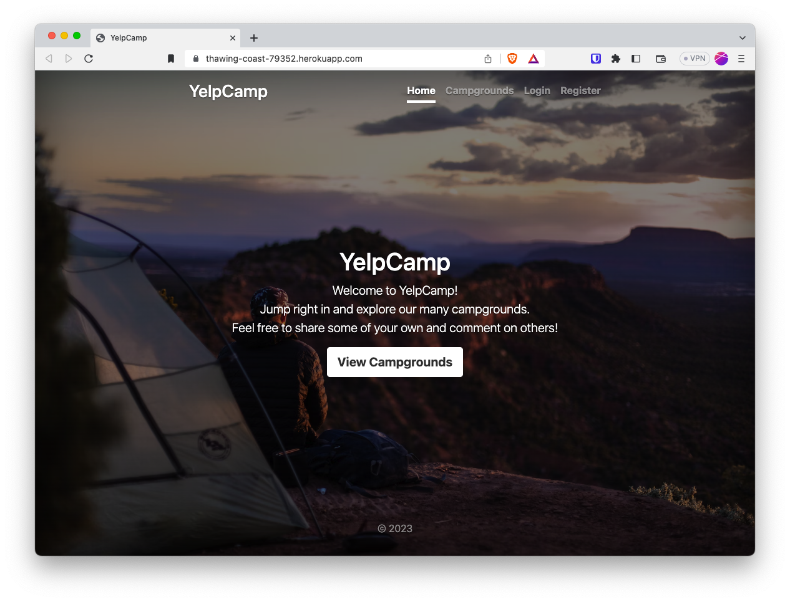
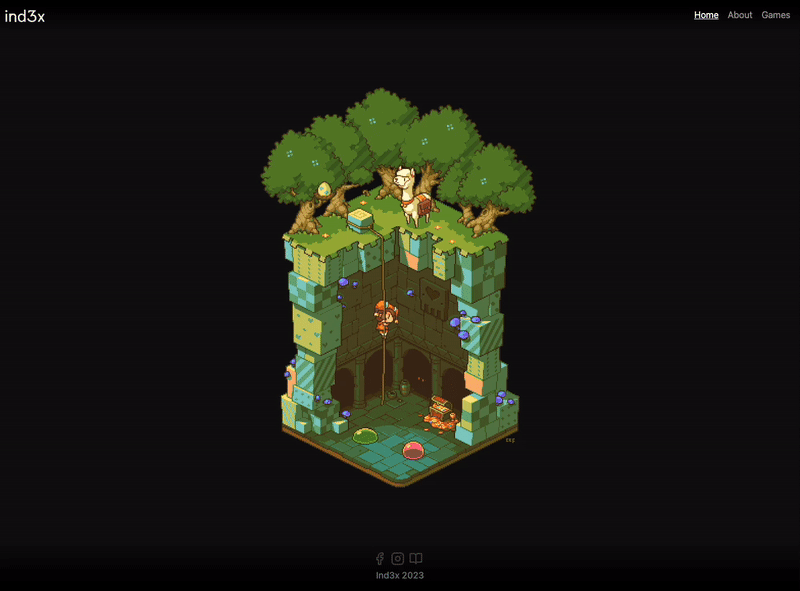
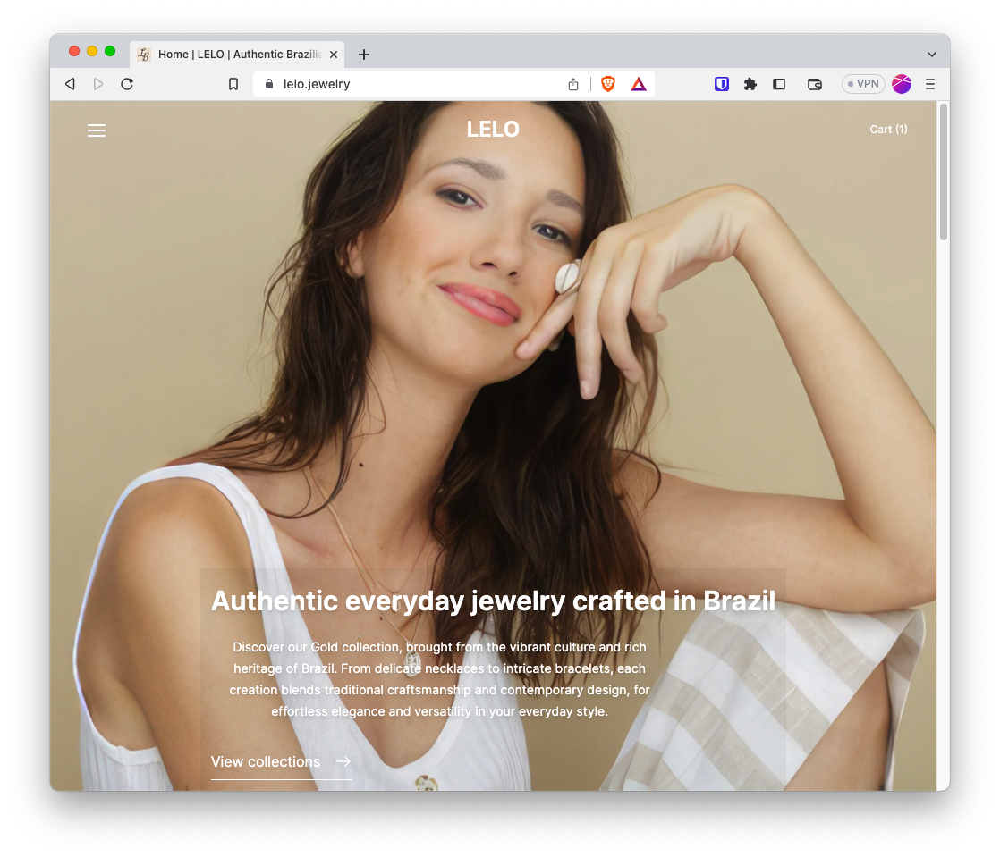

# YelpCamp

- Github: [lollyca/YelpCamp](https://github.com/lollyca/YelpCamp)
- Production: [https://yelpcamp.up.railway.app/](https://yelpcamp-production-0134.up.railway.app/)

**Description**

It is very similar to Yelp but it helps campers to find new campground to explore. 

Built on a modern Node+Express stack. Further details are listed in the [project Readme](https://github.com/lollyca/YelpCamp#built-with)

**Features**

- User registration
- User authentication
- Create new campground site
- Edit Campground created
- Upload images
- Leave a comment
- Leave a review (stars)
- Search for Campground
- Map view of campsites

 

# Ind3x

- Production: [https://index.games/](https://www.ind3x.games/)

**Description**

Ind3x company website

**Features**
- Find games developed by Ind3x
- Information about the company

**Tech used**
- React
- Next.js
- Bootstrap
- Feather Icons
- Illustrator (logo)

**Challenges**
- Grid component

 

# LELO Jewelry

- Production: [https://lelo.jewelry/](https://www.lelo.jewelry/)

**Description**

LELO Jewelry website is a virtual web sorte where clients can browse and shop Authentic Brazilian Jewelry. Includes a admin dashboard where manager can do store inventory control, collect sales information, check payments and have client information for future follow up.

**Features**
For the user:
- Find Brazilian Jewelry: earrings, necklaces, bracelets
- Client Cart
- User account
- Payment System
- Orders management
- Information about the company
For the company:
- Store inventory control
- Add new products
- User account
- Payment System
- Orders management

**Tech used**
- React
- Next.js
- Bootstrap
- Medusajs
- Illustrator (logo and graphics)
- Lightroom (Adobe)

**Challenges**
- Deployment process

 
