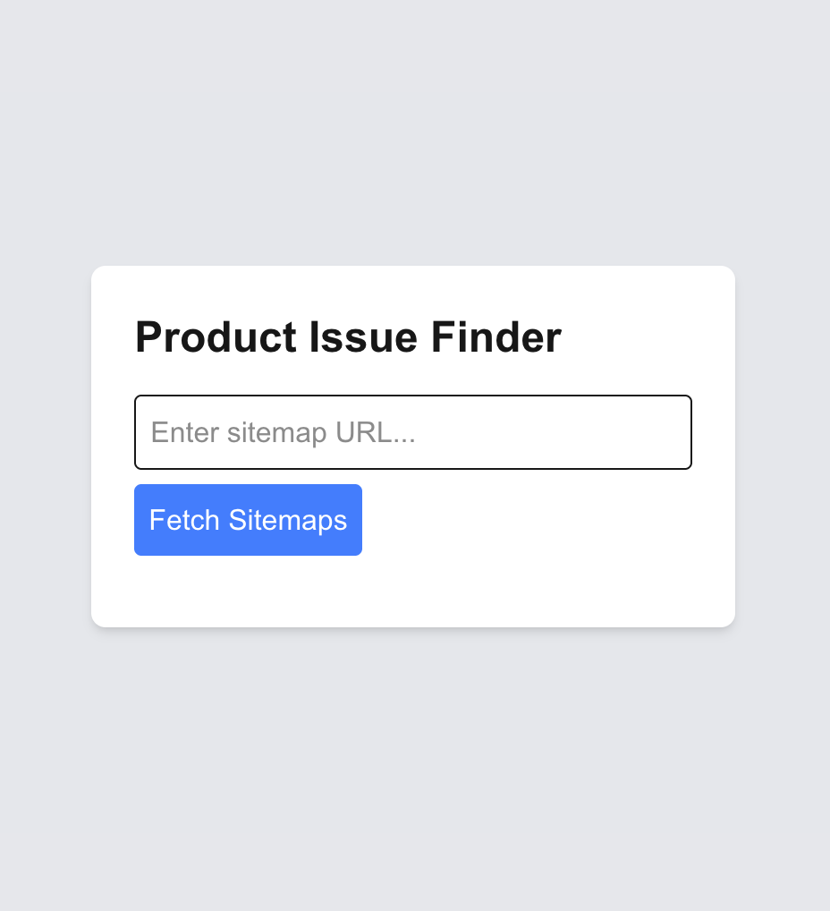
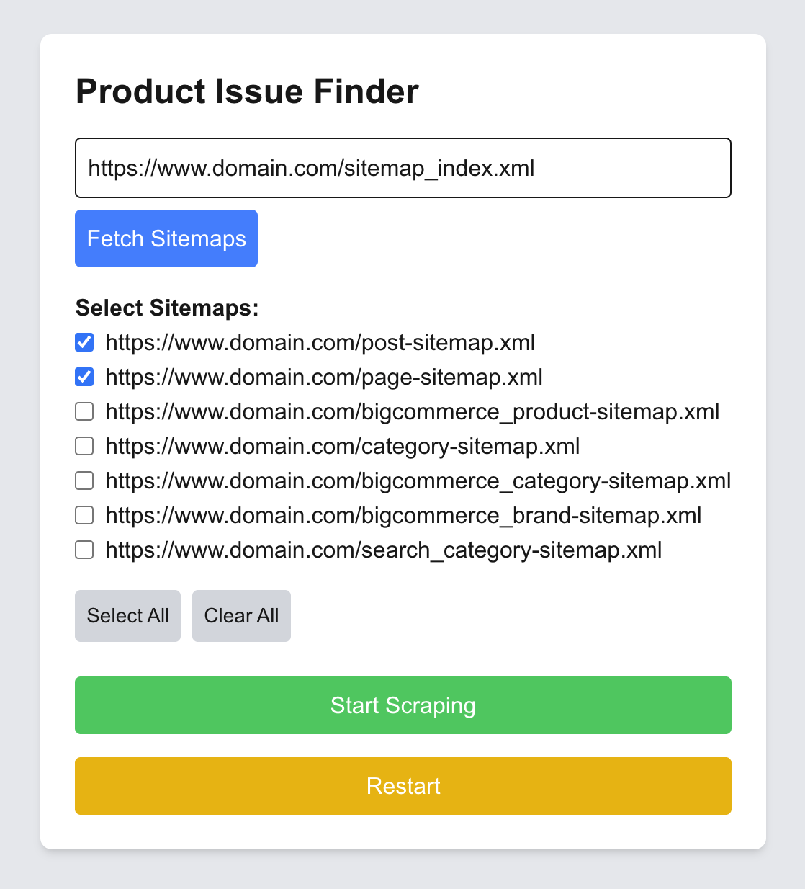
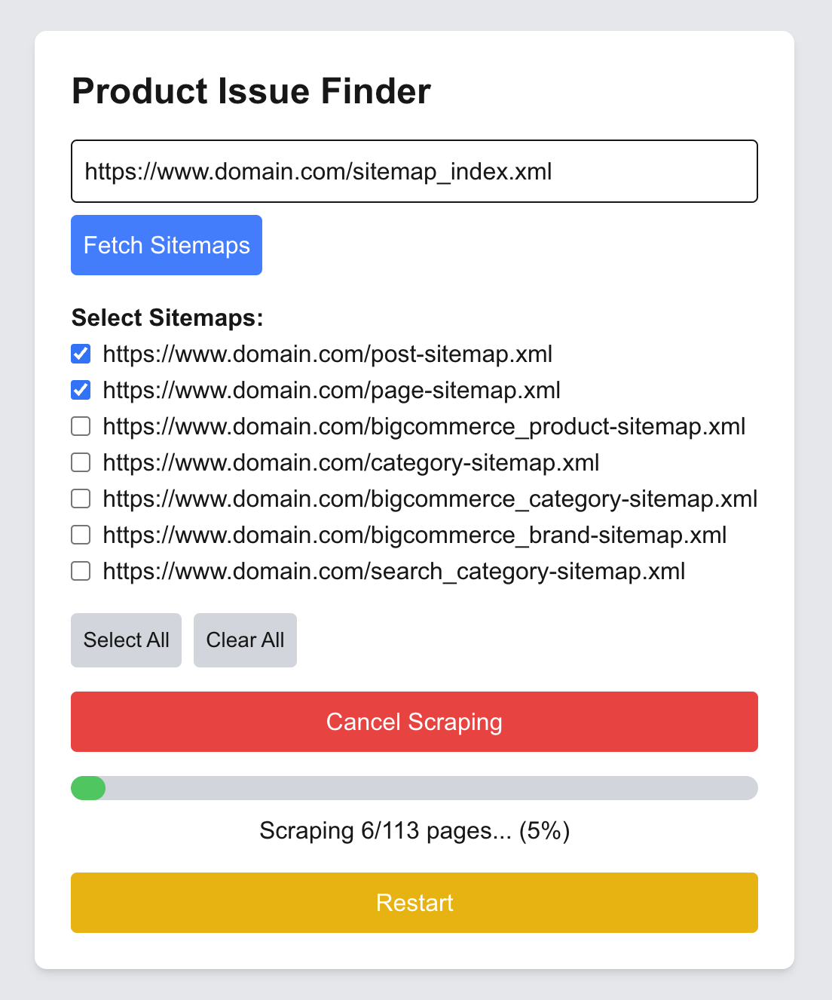
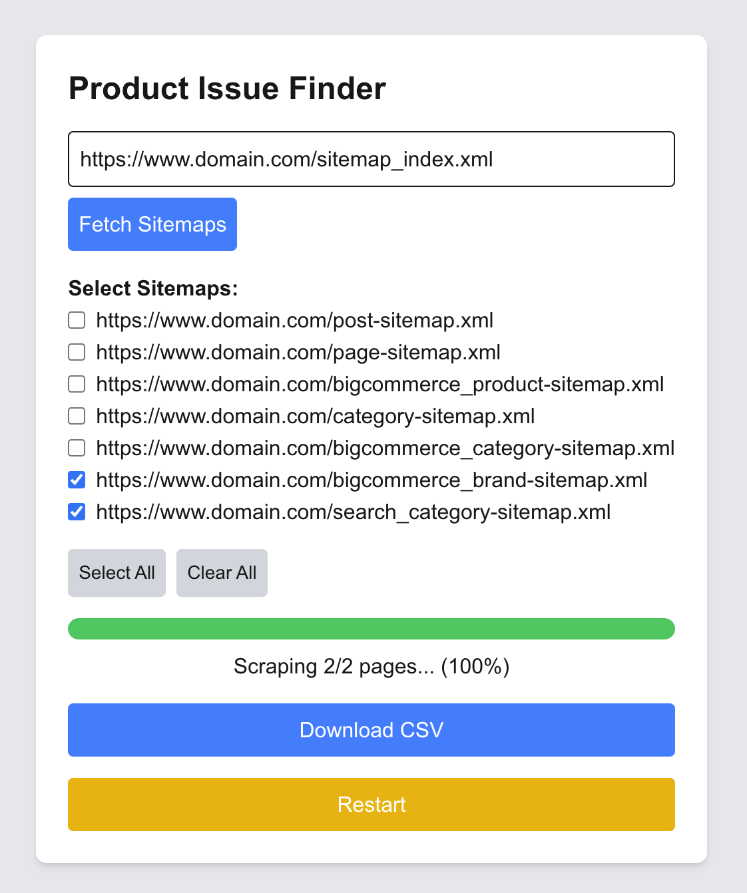
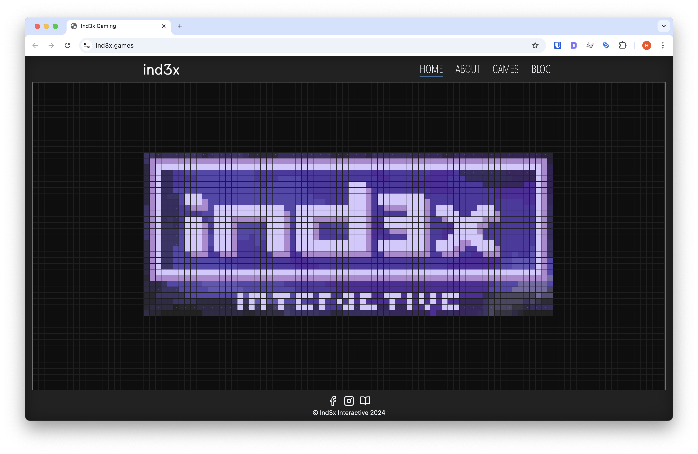
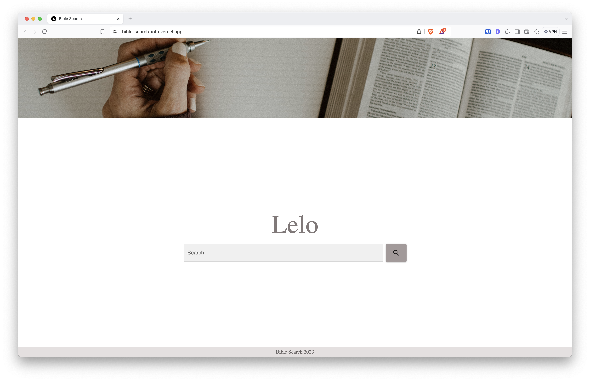

# Product Issue Finder

- Github: [lollyca/product-issue-finder](https://github.com/lollyca/product-card-finder)

  
  
  
  
  
  

### Description

This web app allows users to input their website's sitemap, fetch all discoverable sub-sitemaps, select the ones they want to scan, and scrape product pages for missing information. The scraping is done headlessly using Puppeteer and updates the UI with real-time progress using Server-Sent Events (SSE).

Once scraping is complete, a CSV file is generated and automatically downloaded with a list of product pages missing information (title, price, image, etc).

### Features
- Sitemap Fetching — Input sitemap URL to automatically discover sub-sitemaps
- Sub-sitemap Selection — Pick only the sections you want to scrape
- Headless Scraping — Uses Puppeteer to render pages like a real browser
- Real-Time Progress Updates — Live feedback using Server-Sent Events (SSE)
- Instant CSV Export — Downloads a CSV file with missing information data (no file saving needed)
- Reset & Cancel Controls — Full control of scraping flow for better UX
- Production-Ready — Fully SSR with Bun + Next.js for fast deploys

### Languages

HTML | Javascript | CSS | TypeScript

### Tech used
- React
- Next.js
- Tailwind
- Server-Sent Events (SSE)
- Puppeteer

### Challenges
#### 1. Handling Dynamic Content
Most product images are loaded client-side with JavaScript. Traditional HTTP-based scrapers (like `axios` + `cheerio`) wouldn’t work. Puppeteer was used to fully render each page like a real browser.

#### 2. Progress Feedback
I needed a way to communicate scraping progress to the user in real time. Server-Sent Events (SSE) offered a clean solution — lightweight and easy to integrate with React's state. It was a challenge because it was my first time working with SSE.

#### 3. File Downloads in Production
Initially, the app saved CSVs to the `/public` folder, but in production this caused issues with static builds. I refactored to stream the CSV as a response instead, using `Blob` downloads in the browser — no file saving needed.

#### 4. Canceling Long Tasks
Scraping large sites can take time. I added a shared cancel flag that lets users interrupt scraping safely, and the backend respects that flag mid-process.

#### 5. Deploying Puppeteer on Vercel
Vercel’s serverless functions don’t support long-running or headless browser processes like Puppeteer out of the box. To avoid limitations, I opted to run the app on a traditional server environment using Bun and Next.js with Node compatibility. This ensured Puppeteer could run in a full environment without hitting memory or timeout issues.

 

# Ind3x

- Production: [https://index.games/](https://www.ind3x.games/)

### Description

Built the company website that allows users to browse Ind3x games and find the best platform to download each title. The site loads in under 2 seconds and scores 100% on Lighthouse Accessibility and SEO.

### Features
- Find games developed by Ind3x
- Information about the company

### Languages

HTML | Javascript | CSS | TypeScript

### Tech used
- React
- Next.js
- Tailwind
- Bun

### Challenges
While building the `PixelGrid` component, I ran into several tricky parts that taught me a lot about working with the DOM, React state, and performance optimizations.

#### 1. Making the Grid Responsive
The grid had to fit nicely inside whatever space it's given, no matter the screen size. I had to:
- Figure out how many pixels would fit by dividing the container's width and height by the pixel size.
- Add a debounced resize listener so the grid doesn’t recalculate too often when resizing.

#### 2. Centering the Image in the Grid
I needed to center the image inside the pixel grid, which meant:
- Adjusting every pixel’s position to line up with the image’s center.
- Skipping pixels that would go out of bounds when the image didn’t fully fit in the grid.

#### 3. Showing the Right Colors
Every grid pixel shows a color from either the "front" or "back" image. To get the right color:
- I calculated the x and y position in the image based on the pixel’s index in the grid.
- If the position was outside the image, I showed a background color and marked it as a “dead” pixel.

#### 4. Handling Touch Devices
Touchscreens don’t fire `mouseenter` or `mouseover` like a mouse does. To support touch interfaces, custom logic was needed to simulate hover effects and this was done by:
- I listened for `touchmove` events.
- Then I used `elementFromPoint()` to figure out which pixel was being touched and manually fired mouse events.

#### 5. Avoiding Unnecessary Renders
Since the grid has a lot of pixels, I didn’t want React to re-render them all the time. To avoid unnecessary re-renders, pixel data is generated using `useMemo` but I had to be careful with how I updated the pixel array to avoid bugs from mutating state directly.

 

# Bible Search

- Github: [lollyca/bible-search](https://github.com/lollyca/bible-search)
- Production: [https://verse-search.vercel.app/](https://verse-search.vercel.app/)

### Description

It is a search tool where user can find bible verses related to a specifc keyword. User can also filter by book and change between bible versions.

### Features
- Find bible verses via keyword search
- Change bible version
- Filter by bible book

### Languages

HTML | Javascript | CSS | TypeScript

### Tech used
- React
- Next.js
- Bootstrap
- Third party APIs

### Challenges
Overall, these challenges helped me learn more about how to integrate third-party APIs, manage URL-based state, and make apps more user-friendly and shareable:

#### 1. Figuring Out the Third-Party API
One of the main challenges was working with the external Bible API. The documentation was either missing or not very clear, especially when it came to using the keyword search. It took some trial and error to figure out the correct query parameters and how to structure the request to get back the results I wanted.

#### 2. Making Searches Shareable
Another tricky part was updating the URL with the user's keyword so they could copy the link and share it with friends. Since the app uses Next.js and client-side routing, I had to learn how to work with query parameters in a way that kept the search state in sync with the URL. This was a new concept for me, and it took some time to get right.

 

# LELO Jewelry

- Production: [https://lelo.jewelry/](https://www.lelo.jewelry/)

### Description

LELO Jewelry website is a virtual web sorte where clients can browse and shop Authentic Brazilian Jewelry. Includes a admin dashboard where manager can do store inventory control, collect sales information, check payments and have client information for future follow up.

### Features
For the user:
- Find Brazilian Jewelry: earrings, necklaces, bracelets
- Client Cart
- User account
- Payment System
- Orders management
- Information about the company
For the company:
- Store inventory control
- Add new products
- User account
- Payment System
- Orders management

### Languages

HTML | Javascript | CSS | TypeScript

### Tech used
- React
- Next.js
- Bootstrap
- Medusajs
- Illustrator (logo and graphics)
- Lightroom (Adobe)

### Challenges
- Deployment process

 

# YelpCamp

- Github: [lollyca/YelpCamp](https://github.com/lollyca/YelpCamp)
- Production: [https://yelp-camp-gamma-sandy.vercel.app/](https://yelp-camp-gamma-sandy.vercel.app/)

### Description

It is very similar to Yelp but it helps campers to find new campground to explore. 

Built on Node+Express stack. Further details are listed in the [project Readme](https://github.com/lollyca/YelpCamp#built-with)

### Features
- User registration
- User authentication
- Create new campground site
- Edit Campground created
- Upload images
- Leave a comment
- Leave a review (stars)
- Search for Campground
- Map view of campsites

### Languages

HTML | Javascript | CSS

### Tech used
- Node.js
- Express.js
- MongoDB
- Mongoose
- Bootstrap

### Challenges
- It was my first fully developed Full Stack project :)
